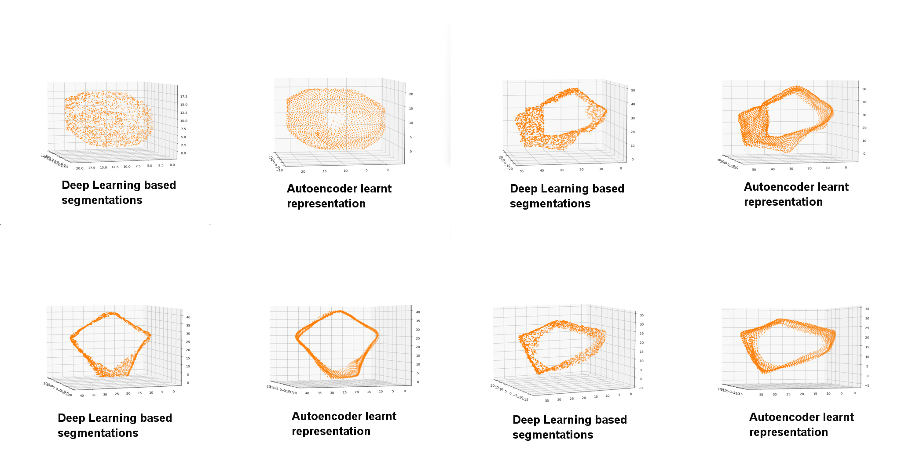

# From Segmentation to Point Clouds

Once we have obtained 3D segmentation from any of the chosen VollSeg mode we apply a trained autoencoder model on the segmented result and using the vollseg extension [TrackMate] to obtain a point cloud representation of the segmented labels. 

We provide a [script](scripts/visualize_point_clouds.py) to visualize point cloud representation for the input segmentation image (binary) using classical and autoencoder model predictions. We create the point cloud representation after applying a trained autoencoder model on the obtained segmented 3D labels. By using the latent dimensions to obtain the point cloud representation the obtained cell shape attributes are significantly more accurate than just using Marching cubes like algorithms on the segmented labels as shown in this comparision .

## Autoencoder

This is an algorithm developed by [Sentinal](https://www.sentinal4d.com/) AI startup of the UK and they created a [pytorch](https://github.com/Sentinal4D) based program to train autoencoder models that
generate point cloud representations. KapoorLabs created a [Lightning version](https://github.com/Kapoorlabs-CAPED/KapoorLabs-Lightning) of their software that allows for multi-GPU training. In this plugin autoencoder model is used to convert the instances to point clouds, users can select our pre-trained models or choose their own prior to applying the model. The computation is then performed on their GPU (recommended) before further analysis is carried out. As this is an expensive computation we also provide a [script](scripts/apply_autoencoder.py) to do the same that can be submitted to the HPC to obtain a master XML file that appends additional shape and dynamic features to the cell feature vectors therby enhancing the basic XML that comes out of TrackMate.

[TrackMate]: https://github.com/Kapoorlabs-CAPED/vollseg-napari-trackmate