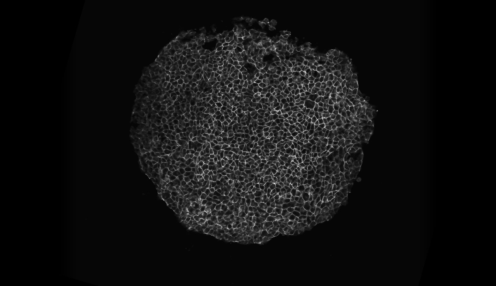
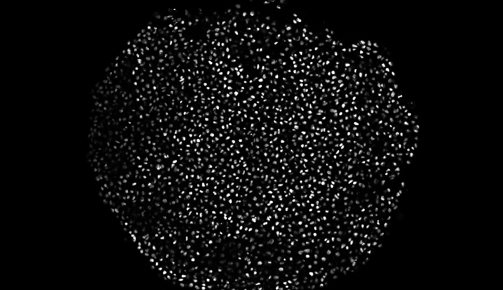

# Xenopus joint Nuclei and Membrane Segmentation

Xenopus model organism is imaged using confocal microscopy in both the nuclei and membrane labelled channels in 3D. We adopt different methods for segmenting both the channels using different VollSeg setting for each one of them in full dimensionality (3D). This method assumes that one to one correspondence between the nuclei and membrane channel is not always true.

| Raw Xenopus Membrane | Xenopus Membrane Labels 
|:-------------------:|:--------------------------:|
|  |  | 

| Raw Xenopus Nuclei | Xenopus Nuclei Labels |
| :-----------------------:|:-----------------------:|
 | |
## Nuclei Segmentation

For the nuclei channel we have developed a method to segment the whole timelapse sequence that grows from a small region to occupying the full imaging volume. In this mode of experiment the sample is present in the same field of view at the beginning of the experiment as it is at the end of the experiment. This creates a situation where a lot of dark pixels are present in the image during early timepoints whose number decreases as the experiment proceeds. To address that we have a trained model to obtain the 2D region of interest in whicht he segmentation and normalization of the image is performed and a second StarDist model trained in 3D to segment the nuclei pixels. The end result of this algorithm is the instance labels and the region of interest of the timelapse movie.

## Membrane Segmentation

For the membrane segmetation we have a trained cellpose model that segments the 3D region using a slice by slice 2D segmentaiton approach and stitches the volume to return 3D segmented membrane labelled cells. To keep a balance betwen over and under segmentation we found the flow threshold of 0.7 achieves that for our trained cellpose model. We also have a trained StarDist model that acocunts for the remaining missing cells, StarDist model outputs the membrane probability map and detects the location of the membrane labelled cells, we use those detected locations to perform marker controlled segmentation int he regions missed by CellPose to obtain a complete segmentation of cells where there is any signal present. 

## Script

The scripts used for this step are: [membrane segmentation script with cellpose and stardist](scripts/cellpose_stardist_membrane.py), [membrane segmentation script with cellpose only](scripts/cellpose_membrane.py),  [nuclei segmentation script](scripts/xenopus_nuclei.py)

